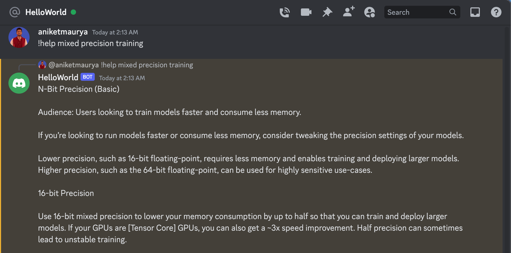

# discord-llm-bot

LLM powered Discord Bot that works seamlessly on CPU. Powered by LanceDB and Llama.cpp.

1. Create a Discord bot and install to your channel [Learn more](https://discordpy.readthedocs.io/en/stable/discord.html)
1. Initalize embedding model [here](./src/qna/model.py)
1. Run [app.py](./src/app.py)

## Demo

