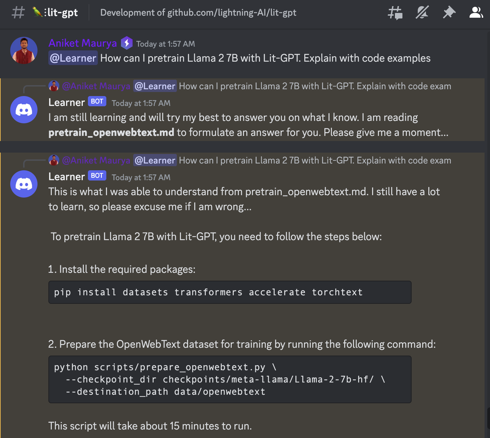

# Discord-LLM-Bot

LLM powered Discord Bot that works seamlessly on CPU. Powered by LanceDB and Llama.cpp.

This Discord bot is designed to helps answer questions based on its knowledge base. By default, it contains knowledge of PyTorch Lightning and Lit-GPT.

1. Run [lightning_learner_bot.py](./src/lightning_learner_bot.py)

## Demo

## Getting Started

To get started with Discord-LLM-Bot, follow these steps:

1. **Invite the Bot to Your Server**:
   - Create a Discord bot and install to your server. [Learn more](https://discordpy.readthedocs.io/en/stable/discord.html)
   - Make sure you have the necessary permissions to add the bot to your server.

1. **Run the bot**:
   - Add bot token to environment variable as `LEARNER_BOT_TOKEN`
   - Run the Python script: `python src/lightning_learner_bot.py`

1. **Usage**:
   - Once the bot is in your server, you can start asking questions by mentioning the bot (e.g., `@discord-llm-bot How does Lit-GPT work?`).
   - The bot will reply with helpful information and explanations.

## Example Usage

Here are some examples of how you can use Discord-LLM-Bot:

- `@discord-llm-bot What is PyTorch Lightning?`
- `@discord-llm-bot Explain Lit-GPT architecture.`
- `@discord-llm-bot Show me an example of using PyTorch Lightning for image classification.`

## Contributing

If you want to contribute to this project or have suggestions for new features, feel free to open an issue or create a pull request. All contributions are welcome from the community.

## Disclaimer

Discord-LLM-Bot is a personal project created for fun and educational purposes. It is not affiliated with or endorsed by the official Lightning AI team.

## License

This project is licensed under the MIT License. See the [LICENSE](LICENSE) file for more details.

Enjoy using Discord-LLM-Bot for learning and exploring PyTorch Lightning and Lit-GPT!
